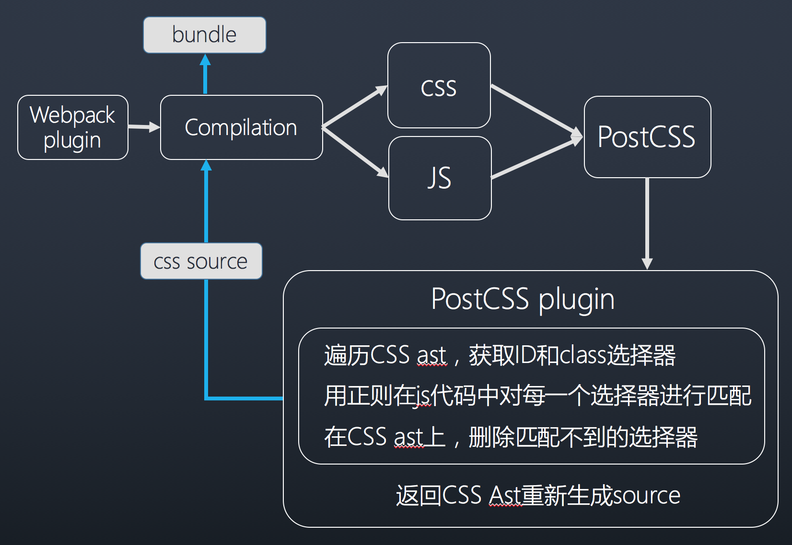

# remove-uncss-webpack-plugin

a webpack plugin to shake unused css code

-------

## how to use

```javascript
npm install remove-uncss-webpack-plugin -D
```

config it in your webpack configuration file, it depends on extracting styles to a file, so please use ExtractTextPlugin first.

```javascript
var ExtractTextPlugin = require('extract-text-webpack-plugin')
const CssTreeShakingPlugin = require("remove-uncss-webpack-plugin")

module.exports = {
  plugins: [
    new CssTreeShakingPlugin({
      remove: false,
      ignore: ['state-\d']
    }),
    new ExtractTextPlugin({
      filename: 'build/style.css'
    })
  ]
};
```

## configuration


property | type | default | discription
-------- | ---- | ------- | -----------
remove | boolean | false | whether to remove unused css
ignore | array | [] | items can be a string or a regexp


## architechture


## Examples

- [tree-shaking-practice](https://github.com/careteenL/tree-shaking-practice)
